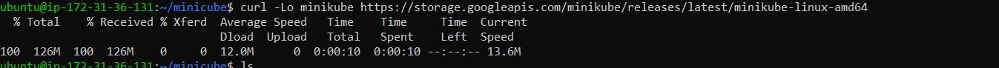
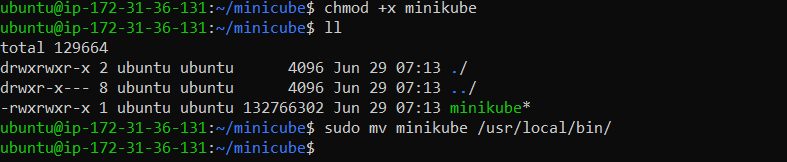
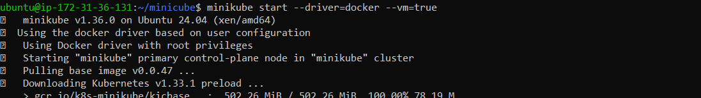
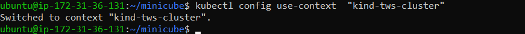

# Minikube Installation Guide for Ubuntu

This guide provides step-by-step instructions for installing Minikube on Ubuntu. Minikube allows you to run a single-node Kubernetes cluster locally for development and testing purposes.

## Pre-requisites

* Ubuntu OS
* sudo privileges
* Internet access
* Virtualization support enabled (Check with `egrep -c '(vmx|svm)' /proc/cpuinfo`, 0=disabled 1=enabled) 

---

## Step 1: Update System Packages

Update your package lists to make sure you are getting the latest version and dependencies.

```bash
sudo apt update
```

<!--<kbd></kbd>-->


## Step 2: Install Required Packages

Install some basic required packages.

```bash
sudo apt install -y curl wget apt-transport-https
```

<kbd></kbd>

---

## Step 3: Install Docker

Minikube can run a Kubernetes cluster either in a VM or locally via Docker. This guide demonstrates the Docker method.

```bash
sudo apt install -y docker.io
```
<kbd></kbd>


Start and enable Docker.

```bash
sudo systemctl enable --now docker
```

Add current user to docker group (To use docker without root)

```bash
sudo usermod -aG docker $USER && newgrp docker
```
Now, logout (use `exit` command) and connect again.

---

## Step 4: Install Minikube

First, download the Minikube binary using `curl`:

```bash
curl -Lo minikube https://storage.googleapis.com/minikube/releases/latest/minikube-linux-amd64
```

Make it executable and move it into your path:

```bash
chmod +x minikube
sudo mv minikube /usr/local/bin/
```

<kbd></kbd>

---

## Step 5: Install kubectl

Download kubectl, which is a Kubernetes command-line tool.

```bash
curl -LO "https://dl.k8s.io/release/$(curl -L -s https://dl.k8s.io/release/stable.txt)/bin/linux/amd64/kubectl"
```
**Check above image ⬆️**
Make it executable and move it into your path:

```bash
chmod +x kubectl
sudo mv kubectl /usr/local/bin/
```
<!--kbd></kbd-->

---

## Step 6: Start Minikube

Now, you can start Minikube with the following command:

```bash
minikube start --driver=docker --vm=true 
```
<kbd></kbd>

This command will start a single-node Kubernetes cluster inside a Docker container.

---

## Step 7: Check Cluster Status

Check the cluster status with:

```bash
minikube status
```

<!--kbd></kbd-->


You can also use `kubectl` to interact with your cluster:

```bash
kubectl get nodes
```
---
## To changing the pointing of minicube configured kubectl to kind-cluster kubectl:

```bash
kubectl config use-context kind-yourclustername
```
<kbd></kbd>
---

## Step 8: Stop Minikube

When you are done, you can stop the Minikube cluster with:

```bash
minikube stop
```

---

## Optional: Delete Minikube Cluster

If you wish to delete the Minikube cluster entirely, you can do so with:

```bash
minikube delete
```


That's it! You've successfully installed Minikube on Ubuntu, and you can now start deploying Kubernetes applications for development and testing.
```
